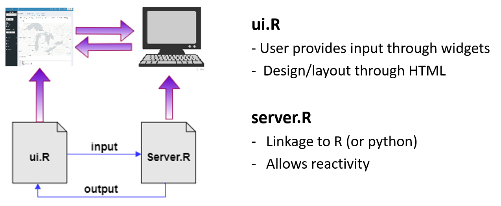
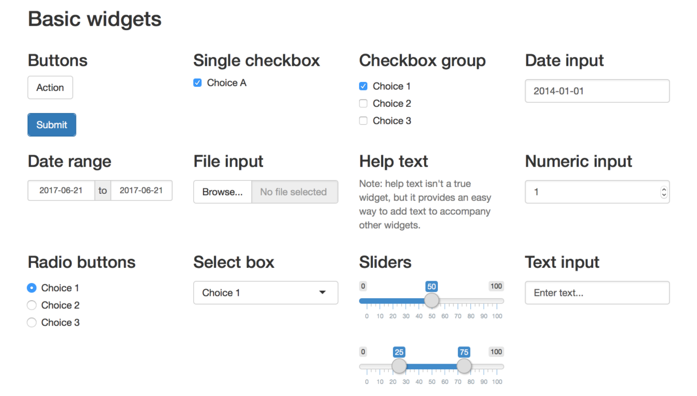
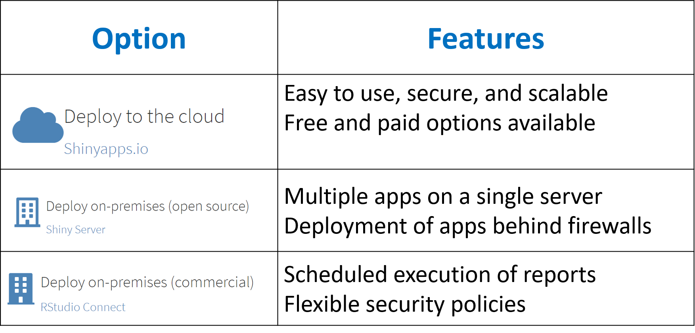
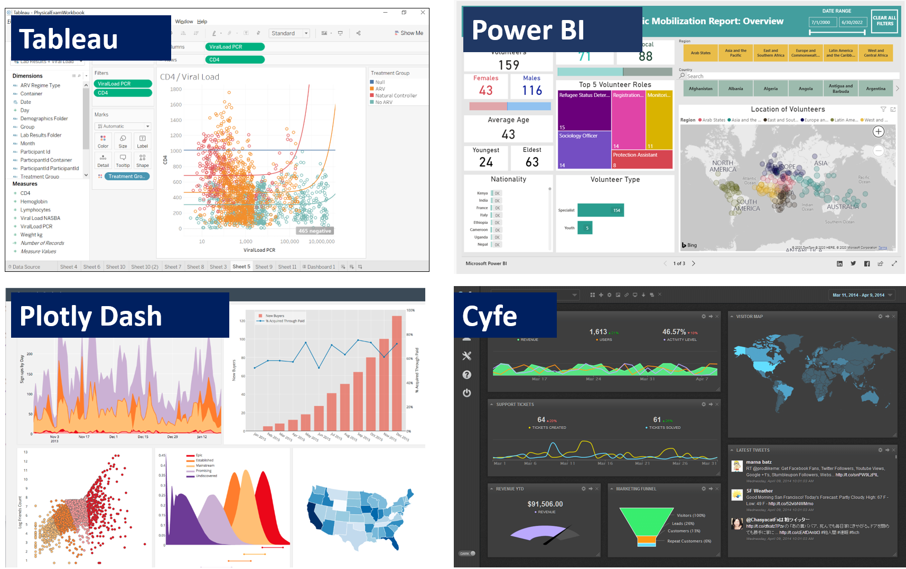
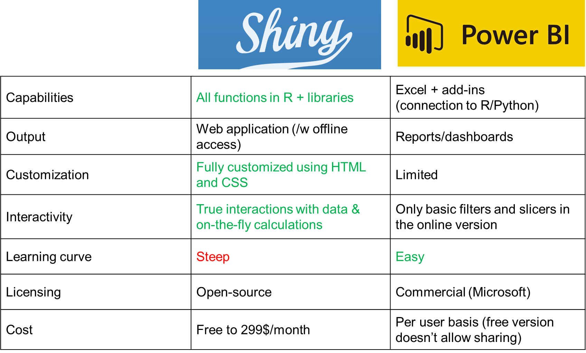
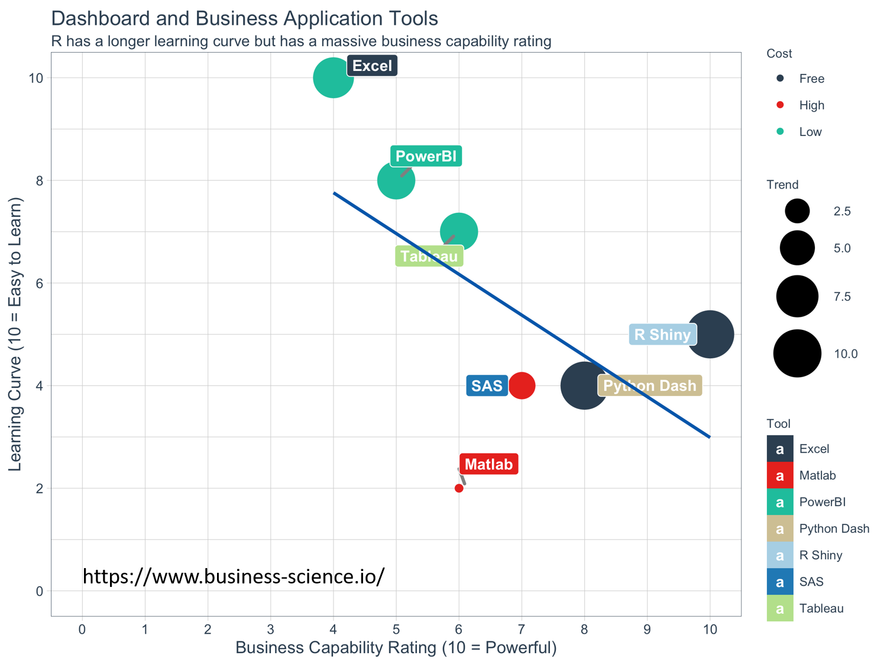

## What do we cover in this lunch lecture

- Quick intro of interactive dashboards with Shiny
- Compare with other options such as Power BI
- Use cases & examples 

## Shiny is a framework that turns your data into interactive web applications

<figure>
  </img>
  <figcaption>
<small>https://shiny.rstudio.com/</small>
</figcaption>
</figure>

## Main Features

- Open-source, uses R programming language
- Full interactivity (computations on the fly)
- Interactive display and manipulation of data
- Appearance fully customizable with HTML, CSS and JavaScript
- No installation required
- Can be shared as a web-page hosted on a server

## Basic structure

</img>

## HTML widgets

</img>

## How to share with colleagues/clients?

Share as R files or simply as an URL (web link)

</img>

## Alternatives

</img>

## Shiny vs Power BI

</img>

## Shiny vs others

</img>

